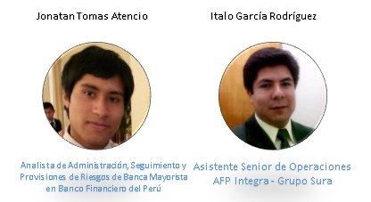

# Financiatech
Financiatech es un asesor financiero online que permite invertir los ahorros de jóvenes profesionales entre 18 y 30 años. Este asesor financiero orienta la inversión de acuerdo al perfil que posee cada persona y toma como objetivos las motivaciones, así como las metas de cada una.

## Desarrollado para
 [Italo Garcia Rodriguez](https://www.linkedin.com/in/italogarcia/)

### Tabla de contenido
- [Idea de Negocio](#idea-de-negocio)
- [Público objetivo](#público-objetivo)

- [Stakeholders del proyecto](#stakeholders-del-proyecto)

- [Pautas para el KICK OFF MEETING](#pautas-para-el-kick-off-meeting)

- [Business Model Canvas](#business-model-canvas)

- [Propuesta de research](#propuesta-de-research)

- [Trello de organización](#trello-de-organización)
- [Nuestro proceso de UX](#nuestro-proceso-ux)

- [User Research](#user-research)

- [User Flow](#user-flow)
- [Task Flow](#task-flow)
- [Equipo de trabajo](#equipo-de-trabajo)

### **NUEVA EXPERIENCIA EN UNA PLATAFORMA DE INVERSIONES**

### **Contexto**

Jonatan e Italo son un par de emprendedores dedicados a las finanzas desde hace un par de años. Actualmente estan intersados en implementar un servicio con dos principales características: 
1. Asesoría financiera online.
2. Administradora de recursos e inversiones.

Para esto se han inspirado en dos fintech de países vecinos  [Fintual](https://fintual.cl/) (Chile) y [Warren](https://oiwarren.com/) (Brasil).

Se han propuesto crear una fintech 100% digital con las características anteriormente descritas.

### **Idea de negocio**

ASESOR FINANCIERO ONLINE QUE PERMITE INVERTIR DE ACUERDO A TU PERFIL Y OBJETIVOS.

### **Público Objetivo**
Jóvenes profesionales entre los 18 y 30 años.

### **Stakeholders**
- Emprendedores.
- Usuarios.
- Reguladores estatales y financieros.

### **Reunión kick-off**
#### **Entrevistas a los socios**
1. ¿Cuál es el mensaje que se desea transmitir a los clientes?
- Ser una fintech amigable creada para jóvenes profesionales que no saben de inversiones y desean cambiar la forma en que  manejan su dinero.

2. ¿Cuáles son las principales características de la fintech?
La fintech debe poseer lo siguiente:
- Elaborar un perfil de inversor en base a un banco de preguntas aleatorias.
- Almacenar los siguientes datos:
    - Nombre completo.
    - Edad.
    - Dirección.
    - Teléfono.
    - Datos de la empresa en que labora.
    - Ingresos mensuales.
    - Tiempo de inversión.
    - Email.
    - Datos de cuenta bancaria.
- Creación de un usuario y contraseña.
- Capacidad de autogestión del usuario para ver el rendimiento de su inversión.
- Opciones de inversión en renta fija y variable.
- Dashboard con indicadores de inversiones.
3. ¿Cuáles son sus principales competidores o modelos a seguir?
En este caso seríamos los primeros en Perú, tenemos modelos a seguir como : [Fintual](https://fintual.cl/) (Chile) y [Warren](https://oiwarren.com/) (Brasil).

Adicional a las preguntas, ellos brindaron un flujo de la fintech. 

#### **Reguladores estatales y financieros**
1. ¿Cuáles son las principales limitaciones que tenemos?
- Reglamentación en lavado de activos.
- Autenticación de identidad.
- Declaraciones de origen de fondos y Compliance.
#### **Guía de entrevistas a usuarios**
- **Building Rapport**

1. 	Por favor, me indicas tu nombre.
2.	Podría indicarme tu edad.
3.	¿Qué tal? ¿Cómo estuvo tu día hoy?
4.	Cuéntame sobre ti. ¿Cómo te defines? ¿Con quienes vives? ¿Qué haces cuando tienes tiempo libre?
5.	¿A qué te dedicas actualmente? (Trabajas, estudias, ambas)

- **Ahorros e ingresos**

1.	Cuéntame ¿Ahorras actualmente?
2.	¿Cuánto ahorras mensualmente en promedio?
3.	¿Cuáles son los motivos por los cuales ahorras?
4.	¿En los próximos 6 meses a cuánto ascenderá tu ingreso mensual aproximadamente?

- **Objetivos y motivaciones**
1.	¿Posees alguna meta o sueño en especial en la vida para ti o para tu familia? 
2.	¿Qué estás haciendo actualmente para lograrlo?

- **Inversiones**

1.	¿Alguna vez has invertido? ¿Por qué?
2.	¿Por qué decidiste invertir? o ¿Por qué no?
3.	¿Estarías dispuesto a invertir parte de tus ahorros? ¿Por qué? 

- **Otras preguntas**

1.	Si te presentará una aplicación en la mediante la cual puedas invertir parte de tus ahorros. ¿Cómo te la imaginas? ¿Qué desearías que tenga? ¿Qué desearías que te informe?
2.	¿Desearías que ese monto de tus ahorros a invertir, se debite de una cuenta principal, depositarlo o transferirlo?
3.	Este monto a invertir lo realizarías de forma mensual, anual o en que periodos

- **Debrief**

De las cosas que hemos conversado.
¿Hay alguna pregunta que deseas realizar?
Cómo mencione, es un poco para saber cómo interactúan los usuarios con sus ahorros e inversiones.

### **Business Model Canvas**

### **Plan propuesto de investigación**

#### **Objetivo de la investigación:**
Identificar las variables que determinan el comportamiento de los jóvenes profesionales en temas ahorro e inversión y analizar su comportamiento en el contexto financiero digital.

#### **Objetos a investigar:**
- Fintech de otros países.
- Jóvenes profesionales entre 18 y 30 años.
#### **Técnicas a utilizar:**
- Encuestas online
- Entrevistas a profundidad
- Benchmark
- Testing
### **Planner del proyecto**
EN PROCESO 
### **Proceso de diseño**

### **DESCUBRIMIENTO E INVESTIGACIÓN**
### **Recopilación y análisis de datos**
#### **Encuestas online**
Realizamos encuestas online a 50 personas con las siguientes preguntas:
 1. _**Edad:**_

 2. _**Género**_  

 
  
  3. _**¿A qué te dedicas actualmente?**_  
  
 
 4. _**¿A cuánto asciende tu ingreso mensual?**_  
 
 
 5. _**¿Cuánto estas dispuesto a ahorrar mensualmente?**_ 
  
 
 6. _**¿Cuáles son los motivos por los que ahorras?**_  
 

7. _**¿Alguna vez has invertido?**_  
 

8. _**¿Por qué decidiste invertir? o ¿Por qué no?**_  
- ¿Por qué decidiste invertir?
    - Inverti para generar un ingreso adicional.
    - Para viajar al extranjero.
    - Para ganar en base a la inversión y los intereses, duplicar mi presupuesto, generar más ingresos.
    - Quise incursionar en un negocio propio / Tener crecimiento empresarial.
    - Construir mi vivienda

- ¿Por qué decidiste NO invertir?
    - No deseaba variaciones en mis ingresos. 
    - No me genera confianza.
    - No me siento preparado.
    - Falta de dinero.
    - No me interesa.
    - Falta de información acerca de la financiera.
    - No sé en que invertir
    - Porque estoy ahorrando y evaluando en que invertir
    - Prefiero solo ahorrar
    - Para invertir se necesita una gran cantidad de dinero.
    - No me gustan las finanzas, ni me interesan.
    - Falta de información acerca de las inversiones.
    - Temor a perder el capital.
    - No me gusta arriesgar.
    - No tengo asesoría para invertir

9. _**¿Estarías dispuest@ a invertir un porcentaje de tus ahorros? ¿Qué porcentaje?**_  
10. _**En el caso que no estés dispuesto a invertir. ¿Cuál sería el principal motivo?**_ 

11. _**Si inviertes 1000 soles, existe la posibilidad de ganar 2000 soles así como perder 500. ¿Jugarías esto alguna vez?**_ 
  
12. _**En base a la pregunta anterior.¿Volverías a jugar?**_  

#### **Entrevistas a profundidad**
Se realizaron entrevistas a profundidad con 6 personas a las cuales se les aplicó el siguiente cuestionario:
https://drive.google.com/file/d/1EPWBOsojdfoME-dOiHEI8LKQF0mT2OE6/view?usp=sharing

Las entrevistadas fueron:
> 
- Los audios de las entrevistas se encuentran en el siguiente link:
> https://drive.google.com/file/d/1EPWBOsojdfoME-dOiHEI8LKQF0mT2OE6/view?usp=sharing 

- _**Brainstorming de aplicativo/website/servicio**_  

Adicional a eso se les presento a las entrevistadas la propuesta de una aplicación/web/servicio/producto la cual permita administrar tus ahorros e invertirlos.
Ellas realizaron brainstorming partiendo de esa idea y plasmaron sus ideas en un papel del siguiente modo:
> 

#### **Benchmark**
Se realiza un benchmark con nuestros principales a modelos a seguir:

- Fintual (Chile)
> Es una administradora de dinero creada para jóvenes profesionales que no saben de inversiones o que prefieren ver Netflix antes que estar estudiando el mercado.
- Warren (Brasil)
> Warren es una empresa nueva, pero con una sólida fundación. Son años de experiencia profesional combinados para crear la primera plataforma de inversiones por objetivos de Brasil.

> 

### **Resultados de la investigación**
1. La app debe ser amigable, la comunicación entre el usuario y esta debe ser de forma clara para aquellas personas que simplemente les da flojera o no quieren perder el tiempo revisando temas de finanzas e inversiones.
Además debe plasmar de forma clara que está ocurriendo con el dinero del usuario.
2.  Invertir será posible desde un monto mínimo de 100 soles accesible para jóvenes con un ingreso promedio desde 450 soles mensuales sustentando con los respectivos documentos.
3. Los usuarios están dispuestos a ahorrar hasta 1000 soles mensuales de sus ingresos.
4. Los principales objetivos y motivaciones por lo cuales ahorran son:
    - Vacaciones y viajes.
    - Emergencias e imprevistos.
    - Un negocio propio.
    - Adquirir una vivienda.
    - Jubilación y futuro familiar.
5. Ellos están dispuestos a invertir hasta un 40% de sus ahorros 
6. Nuestros usuarios generalmente no han invertido por falta de confianza, no tienen información acerca de inversiones, no les gustan las finanzas o simplemente les invade el temor a arriesgar.
7. De los usuarios que han invertido lo han hecho en pequeñas cantidades generalmente en compra y venta de producto o en un negocio familiar.
8. El 44% arriesgaría un monto de sus ahorros al menos una vez y el 40% lo volvería hacer.
9. Según nuestros usuarios la aplicación debe enfocarse en los montos invertidos de la siguiente manera:
    -  Mostrar el monto meta, monto a jugar, intéres ganado, monto que puedo rescatar y las fechas de inversión y el tiempo de retorno de la inversión.
    - Sugerir empresas en las cuales pueda invertir mediante un rankinh y por categorías (Educación, salud, servicios, etc).
    - Las empresas en las cuales pueda invertir deben mostrar su nombre, descripcion y un simulador de la tendencia en el caso que decida invertir en ella.
    - Respecto a las inversiones un evolutivo de cada inversión diario, semanal y mensual.
    - El monto a invertir debe debitarse de una cuenta principal.
10. Por otro lado las aplicaciones analizadas se centran en un perfil de inversor y sugerir en que empresas podríamos invertir.

### **SÍNTESIS Y DEFINICIÓN**
### **Affinity Mapping**
Se comenzó a trabajar para realizar el ejercicio de **findings en post it** para posteriormente realizar el **Affinity Mapping** donde se agruparon los principales motivos de inversión y no inversión según su categoría.

Se agruparon los motivos por los cuales los usuarios habían invertido o no en las siguientes categorías.
1. Motivos de inversión
- Generar mayores ingresos.
- Tener un negocio propio.
- Construir una vivienda.
- Viajar al extranjero.
2. Motivos de NO inversión
- Falta de información 
- Genera inseguridad.
- Temor a pérdidas de capital.
- Desinterés.

Luego de analizar todo la información obtenida, nos dimos cuenta de que de las categorías "Falta de Información" y "Temor a pérdidas de capital"  tienen más coincidencia entre nuestros usuarios como principales causas para evitar invertir.
Por lo tanto se abordará estos temas en la aplicación mediante un asesor financiero online e informando de forma clara el nivel de riesgo de acuerdo a la inversión que se realice.

#### **Comentarios de los usuarios**
- "Porque las finanzas o temas de dinero no son lo mío, me causa mucha inseguridad por el tema legal. Pero, si me informase mejor de cómo hacerlo correctamente, me animaría a hacerlo."

- "No tenía muy claro el tema de las inverisiones."
- "Tengo miedo con lo que pueda pasar con mi dinero."
- "No tengo asesoría para hacerlo."
- "Me da miedo y siento que no soy una persona muy orientada a esas cosas."
### **User persona**
#### **User persona primario**
 
#### **User persona secundario**
 
### **Problems Statements**
1. Andrea **necesita** información del rendimiento de las empresas **para** invertir sus ahorros.
2. Andrea **necesita** sugerencias de empresas **para** invertir de acuerdo a su perfil.
3. Andrea **necesita** obtener más ingresos **para** realizar todos sus viajes planeados.
4. Andrea **necesita** invertir de forma sencilla **para** emplear su tiempo en otras actividades.
5. Andrea **necesita** mantenerse informada de sus inversiones **para** tener seguridad de que sus ahorros estan creciendo.
6. Andrea **necesita** un asesor financiero **para** mejorar sus inversiones en un determinado tiempo.
7. Andrea **necesita** rescatar sus inversiones de forma rápida **para** solventar sus gastos en cualquier momento.
8. Andrea **necesita** invertir en el corto plazo **para** obtener ingresos rápidamente.
9. Andrea **necesita** autorizar el uso de su firma digital **para** realizar inversiones en línea.
### **How Might We? (HMW)**
1. **HMW** mostrar información del rendimiento evolutivo a invertir?
2. **HMW** mostrar empresas sugeridas a nuestros usuarios para que inviertan?
3. **HMW** hacer que los usuarios obtengan más ingresos?
4. **HMW** hacer que los usuarios inviertan sin desconfianza?
5. **HMW** informar a los usuarios acerca del comportamiento de sus inversiones?
6. **HMW** asesorar al usuario según su perfil del inversor?
7. **HMW** rescatar rápidamente el dinero de nuestros usuarios?
8. **HMW** mostrar los cálculos en el corto y largo plazo?
9. **HMW** plasmar la firma digital para permitir las inversiones en las empresas.
### **What if?**
1. **What if** no necesitamos la firma para las transacciones?
2. **What if** un asesor realiza los trámites para autorizar el débito del monto mensual?
3. **What if** los usuarios saben de finanzas y no necesitan un asesor?
4. **What if** los usuarios buscan las empresas a invertir y evitamos sugerir?
5. **What if** los usuarios arriesgan un monto mayor del mínimo sugerido?
6. **What if** los usuarios confian en las entidades de inversión'
7. **What if** no existe riesgo al invertir?
8. **What if** el usuario no posee un perfil de inversor?
9. **What if** los usuarios no necesitan evolutivos de sus inversiones?
10. **What if** el usuario rescata el monto actual cuando logra la meta y no en cualquier momento?
### **IDEACIÓN**
### **Feature List**
1. Elaborar un perfil de inversor
2. Establecer un monto mínimo de inversión apoyado en un monto inicial, monto mensual y monto final en base al tiempo.
3. Sugerir empresas en las cuales se pueda invertir de acuerdo al perfil.
4. Autorizar el débito de los montos mediante firma digital.
5. Permite crear objetivos compartidos entre varias personas.
6. Editar montos mensuales, esperados y período de tiempo de inversión.
7. Agregar sugerencias de inversiones a una lista.
8. Eliminar item de lista de empresas sugeridas.
9. Rescatar un monto total u otra cantidad.
10. Editar y eliminar un objetivo.
### **Priorización**
### **Storytelling**
### **PROTOTYPING**  
#### **Arquitectura de la información**
1.  _**Card Sorting**_
- Luego de analizar las necesidades de los usuarios se propusieron 15 items para la arquitectura de información del aplicativo. 
- Se utilizó el card sorting abierto para que los usuarios crearán categorías y agruparán items en estas. 
- En el siguiente link se encuentra la aplicación de la técnica: https://drive.google.com/open?id=1_oUxJWZEQ0nMZj87d2uyjHuHRCA-pUHi

2.  _**Conclusiones del card sorting**_  
- Se modificó "Ranking de mis empresas" por "Ranking de mis inversiones"
- Se agregó "Lista de inversión" y "Rescatar".
- Con estas actualizaciones se logró eliminar los flujos innecesarios, sobretodo reducir los pasos para realizar alguna tarea.
Este es el esquema que se obtuvo como resultado:
 

3.  _**Propuesta de arquitectura de información**_ 
Se plantea 3 flujos principales en que integren las principales tareas:
1. Edición de Datos personales y financieros.
2. Sugerencias de inversión.
3. Rescatar montos parciales y totales de las inversiones.
4. Plantear nuevos objetivos y visualizar los actuales.
 
#### **Paper prototyping - versión 1**
#### **Paper prototyping - versión 2**
#### **Prototipo de alta fidelidad**
### **TESTING**
#### **A/B Testing**
1.  _**Panel principal**_
2.  _**Menú de navegabilidad**_
#### **User Flow**
#### **Task Flow**
#### **Customer Journey Map**
- _**Flujo ideal del producto**_ 
- _**Flujo real del producto**_ 

#### **Primer testing - paper prototyping**
https://marvelapp.com/project/2825855/
- _**Script del testing**_ 
- _**Tareas a realizar**_ 

#### **Segundo testing - paper prototyping**
https://marvelapp.com/project/2829208/
- _**Script del testing**_ 
- _**Tareas a realizar**_ 
#### **Tercer testing - prototipo de alta fidelidad**
https://marvelapp.com/85jc571/screen/40120446
- _**Script del testing**_ 
- _**Tareas a realizar**_ 

### **CONCLUSIONES**

#### **Landing Page**

#### **Tecnología a emplear**
- Nuestro producto es una aplicación nativa, desarrollada tanto para iOS como para Android.

- La elección fue hecha a raíz de que la mayoría de nuestros usuarios  usan sus dispositivos celulares todo el tiempo para estar conectados y para realizar operaciones bancarias y también porque se quiere aprovechar ciertas capacidades tanto del dispositivo como del sistema operativo, por ejemplo:

- Biometría: Opción de la huella dactilar para el ingreso al aplicativo, puesto que esto supone una mayor seguridad para el usuario.

- GPS: Permite el acceso a la ubicación del usuario en la opción de Retiro express.
